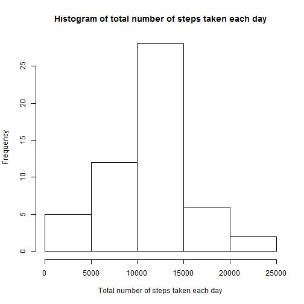
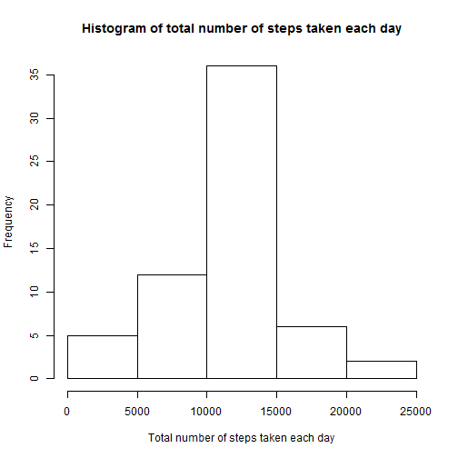

##Loading and preprocessing the data
Here is the R code for processing the data.


```r
#Read data
actData <- read.csv("activity.csv", colClasses = c("integer", "Date", "integer"))

# Throw out rows with NA.
validActData <- actData[complete.cases(actData),]
```

##What is mean total number of steps taken per day?
First I created a vector for the step values.


```r
#Create vector of total number of steps take each day
sumStepsVector <- tapply(validActData[,1], validActData[,2], sum)
```

This is the histogram of the total number of steps taken each day.


```r
hist(sumStepsVector, main="Histogram of total number of steps taken each day", 
      xlab="Total number of steps taken each day")
```

 

The mean and median total number of steps taken per day.


```r
mean(sumStepsVector)
```

```
## [1] 10766.19
```

```r
median(sumStepsVector)
```

```
## [1] 10765
```

##What is the average daily activity pattern?

Creating two vectors: for the averages, and the intervals.


```r
intervalAvgs <- tapply(validActData[,1], validActData[,3], mean)
intervals <- levels(as.factor(validActData[,3]))
```

This is the time series plot of the 5-minute interval (x-axis) and the average number of steps taken, averaged across all days (y-axis).


```r
plot(intervals, intervalAvgs, type="l")
```

 

The 5-minute interval, that contains on average the maximum number of steps is:


```r
intervals[which.max(intervalAvgs)]
```

```
## [1] "835"
```

##Inputing missing values

Total number of missing values:

```r
sum(!complete.cases(actData))
```

```
## [1] 2304
```

For inputting missing values, I used the interval average for the given missing value.
I created a sequence containing the indexes of missing value rows.


```r
sequence <- seq(actData[,1]) #sequence: 1, 2, 3, ..., length(actData[,1])
NASequence <- sequence[!complete.cases(actData)]
```

Then I've created a new dataset in a loop, which loops over the rows with NA-s. First find out which interval, find the average of that interval, and insert it.

```r
newActData <- actData
for(i in NASequence) {
  #which interval
  intvl <- newActData[i,3]
  
  #find the average of that interval.
  intvlAvg <- intervalAvgs[(intervals==intvl)]
  
  #insert value.
  newActData[i, 1] <- intvlAvg
}
```

Here is the new histogram:


```r
sumStepsVector2 <- tapply(newActData[,1], newActData[,2], sum)

hist(sumStepsVector2, main="Histogram of total number of steps taken each day", 
     xlab="Total number of steps taken each day")
```

 

The new mean and median:

```r
mean(sumStepsVector2)
```

```
## [1] 10766.19
```

```r
median(sumStepsVector2)
```

```
## [1] 10766.19
```

